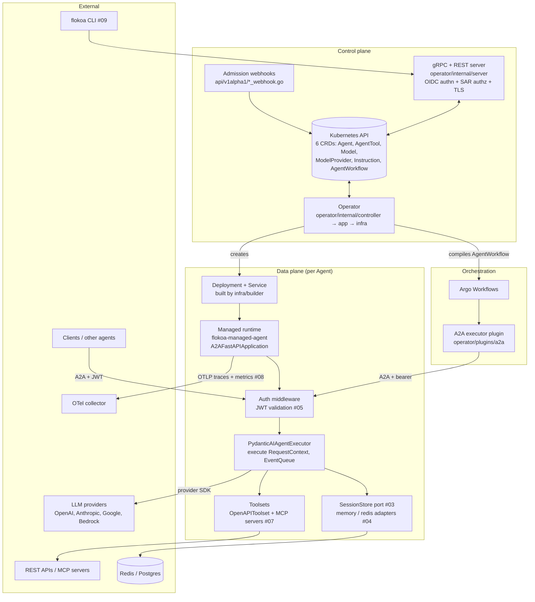
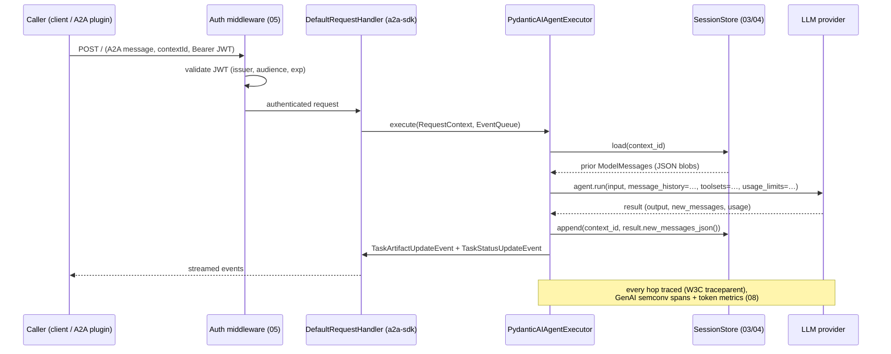

# 00 — Target Architecture: Flokoa as an Agent Harness

This document describes the architecture the roadmap units build toward. It is the reference for design decisions in units 01–14; each unit implements a slice of this picture without contradicting it.

## Definition

An agent harness turns a **declaration** (model, instructions, tools, memory, identity) into a **running, stateful, secured, observable agent**. Flokoa's harness expression of this is Kubernetes-native: the declaration is a set of CRDs, the harness is the operator plus the managed runtime, and the contract between them is a versioned set of mounted files and environment variables.

## Component view

## The operator ↔ runtime contract

The contract is the heart of the harness. The operator (Go) projects CRD state into a pod; the runtime (Python) consumes it. Today's contract, from `operator/internal/infra/builder/deployment.go` and `flokoa_managed_agent/config.py`:

| Channel | Path / variable | Producer | Consumer |
|---|---|---|---|
| Template config | `/etc/flokoa/template-config.json` (ConfigMap `{agent}-template-config`) | `app/agent/reconcile.go` | `load_templated_config()` *(legacy)* |
| Unified agent config | `/etc/flokoa/agent-config.json` (`FLOKOA_AGENT_CONFIG_PATH`) | **not yet written by operator** | `load_managed_agent_config()` → `AgentConfig`/`LlmAgentConfig` |
| Instruction | `/etc/flokoa/instruction.txt` | InstructionReconciler | `FlokoaAgentExecutor.instruction` |
| Tools | `/etc/flokoa/tools/<name>/spec.json` | ToolReconciler | `tool_definitions` (via `ConfigCache`) |
| Model | `/etc/flokoa/model.json` | ModelReconciler | `model_config` |
| Agent card | `/etc/flokoa/agent-card.json` | builder | `load_agent_card()` |
| Server binding | `FLOKOA_HOST`, `FLOKOA_PORT`, `FLOKOA_PUBLIC_URL` | builder | `__main__.main()` |
| Tracing | `OTEL_EXPORTER_OTLP_ENDPOINT`, `FLOKOA_TRACEPARENT` | builder / plugin | `init_telemetry()` |

**Target direction:** new harness features extend this contract with `FLOKOA_*` env vars (secrets via `valueFrom.secretKeyRef`, never materialized) and, over time, migrate per-feature files into the **unified `agent-config.json`**, which already has a Python-side loader and a discriminated-union schema (`LlmAgentConfig`). The legacy files remain supported; the runtime's existing unified-first-then-legacy fallback is the compatibility mechanism. New contract additions in this roadmap:

| Channel | Unit |
|---|---|
| `FLOKOA_SESSION_BACKEND`, `FLOKOA_SESSION_TTL_SECONDS`, `FLOKOA_SESSION_MAX_TURNS`, `FLOKOA_SESSION_REDIS_*` | 03, 04 |
| `FLOKOA_AUTH_MODE`, `FLOKOA_AUTH_ISSUER_URL`, `FLOKOA_AUTH_AUDIENCE` | 05 |
| MCP tool specs via existing `/etc/flokoa/tools/<name>/spec.json` | 07 |
| `OTEL_SERVICE_NAME`, `OTEL_RESOURCE_ATTRIBUTES` injected per agent | 08 |

## Request flow with sessions (target)

The **session identity is the A2A `contextId`** — no new protocol concept. `AgentTrigger.sessionKeyFrom` (`internal/server/trigger_session.go: ExtractSessionKey`) already produces deterministic context IDs from events; sessions make those IDs actually mean something.

## Architectural tenets

1. **CRD is the API; everything else is projection.** Features are declared on CRDs with Kubernetes API conventions (optional pointer blocks, discriminated unions like `RuntimeSpec`/`ModelProviderSpec`, `SecretKeySelector` for credentials, `metav1.Condition` for status). The gRPC/REST server and CLI are views over CRDs, not parallel stores.
2. **Hexagonal in both planes.** Go: app services depend on `internal/infra/repo` interfaces, builders stay pure functions (`BuildDeployment(params)`), tests use `repo/fakes`. Python: capabilities are ports (protocols) with adapters resolved by config — the `integrations/_try_load` registry and `OpenAPIDeps` injection are the house style. New ports in this roadmap: `SessionStore` (03), toolset building per tool type (07).
3. **One schema pipeline.** Go types → `make manifests generate` → CRD YAML → `make generate-python-models` (datamodel-codegen) → `flokoa-types`. Hand-written Python config models (`flokoa/config/agent_config.py`) wrap generated types but never fork field semantics. Any CRD change ships both sides in the same PR.
4. **Secrets never leave the kubelet.** Credentials are `SecretKeySelector` refs projected as env `valueFrom` or volume mounts by the builder (the `ModelProvider.apiKeySecretRef` pattern). Nothing secret goes into ConfigMaps, CRD specs, or logs.
5. **AuthN at each plane's edge, authZ as policy, identity propagated.** Control plane: OIDC interceptor (`internal/server/auth.go`) + SubjectAccessReview against cluster RBAC (06). Data plane: JWT middleware on the A2A endpoint (05). Workload-to-workload calls carry bearer tokens; end-user identity rides A2A metadata for downstream audit.
6. **Stateless runtime, stateful ports.** The runtime process holds no durable state; sessions, task records, and (later) usage accounting live behind store interfaces so pods stay disposable and horizontally scalable. Append-only history writes avoid read-modify-write races (03).
7. **Observability is not optional in the managed runtime.** `Agent.instrument_all()` + FastAPI instrumentation + GenAI semconv attributes are on by default when the operator deploys the template runtime; the operator injects the export endpoint (08). Trace context propagates A2A hop to hop via W3C traceparent (already implemented in the plugin).
8. **Additive evolution behind flags.** New behavior that changes defaults ships behind operator flags (the `--artifact-io-enabled` precedent) or Helm values; CRD fields are optional with safe zero-values; the runtime tolerates missing config.

## Non-goals of this roadmap

- **Per-session microVM isolation and built-in code-interpreter/browser tools** (AgentCore's H2/H5): deliberately deferred; documented as pod-level isolation. Revisit after Phase 1 (see 13 for the design space).
- **Multi-cluster / fleet management.**
- **A second managed-runtime framework** (google-adk stays SDK-only for now; the template runtime remains pydantic-ai).
