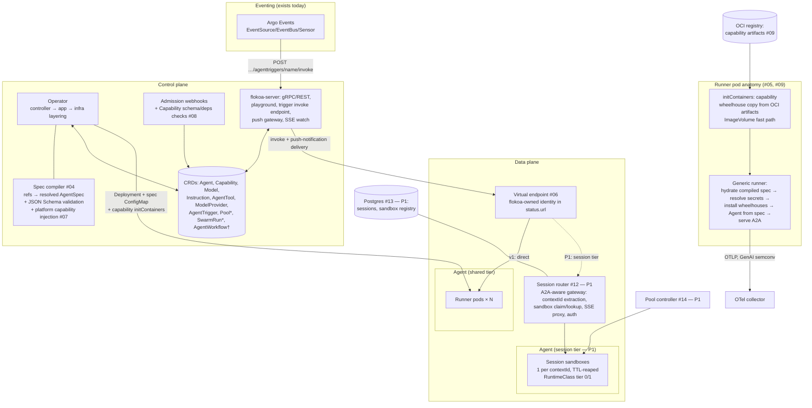

# 01 — Target Architecture (Pivot v2.1)

Reference design for all roadmap units. The brief ([00](00-product-brief.md)) says *what and why*; this says *how the pieces fit*. Grounded in `main@ac123b5`.

## System view



`*` new CRDs · `†` frozen, template-only

## The three load-bearing contracts

### 1. The runtime contract (unit 03) — operator ↔ runner

One versioned document + artifact set per runner release: pinned Python/pydantic-ai/baseline-lib versions (published lockfile), the AgentSpec JSON Schema for that pin, and the file/env interface:

| Channel | Content | Producer | Consumer |
|---|---|---|---|
| `/etc/flokoa/agent-spec.yaml` | compiled, validated AgentSpec (placeholders intact) | spec compiler (#04) via ConfigMap | runner hydration (#05) |
| `/opt/flokoa/capabilities/<name>/` | wheelhouse + manifest per Capability | initContainer / ImageVolume (#09) | runner `pip install --no-index` |
| `${secret:NAME}` placeholders ↔ `FLOKOA_SECRET_*` env | secret indirection | operator (`valueFrom.secretKeyRef`) | runner resolution at hydration |
| `FLOKOA_HOST/PORT/PUBLIC_URL`, `OTEL_*` | serving + telemetry | operator | runner |
| Existing legacy files (`template-config.json`, `instruction.txt`, `model.json`, `tools/`, `agent-card.json`) | **deprecated path** | current reconcilers | current managed-agent — kept working until #04/#05 replace, then removed |

The contract is the *platform*. Changes are versioned (`contractVersion` in the manifest), additive within a runner major, and PR-review-blocking.

### 2. The compiled AgentSpec (unit 04) — CRDs ↔ pydantic-ai

```
Agent CR ──┬─ specTemplate (inline AgentSpec fragment, typed-where-stable)
           ├─ modelRef ───────→ Model CR (typed ModelSettings + extra) ─→ ModelProvider (secrets/endpoints)
           ├─ instructionRefs[] → Instruction CRs (ordered)
           ├─ tools[] ─────────→ AgentTool CRs (MCP endpoint: ServiceRef/URL + auth secret)
           ├─ capabilities[] ──→ Capability CRs (digest-pinned artifact + per-agent config)
           └─ runtime{image?, resources, isolation, pool, runnerVersion?}
                    │
        compile (merge precedence: refs in declared order; inline scalars win; lists append)
        + inject platform capabilities (#07)
        + validate against pinned AgentSpec JSON Schema
                    ▼
        resolved AgentSpec → ConfigMap → status.specHash, SpecValid condition
```

### 3. A2A as the boundary protocol

A2A is the surface **between** deployed Agents, the gateway's external interface, and the trigger/push-notification transport. Swarm-internal coordination (P2) is in-process (harness sub-agents/Teams) — never A2A between swarm members. The A2A `contextId` is the session identity end-to-end: trigger `sessionKeyFrom` mints it, the router routes on it, the sessions backend keys on it.

## Component inventory: current → target

| Component | Today (`ac123b5`) | Target | Unit |
|---|---|---|---|
| Agent controller + app layer | reconciles legacy multi-file config | spec compiler + single spec ConfigMap | 04 |
| `flokoa-managed-agent` | config-file → pydantic-ai Agent, A2A via a2a-sdk | generic runner: spec hydration + capability install | 05 |
| `flokoa` SDK | CLI `run`, integrations registry (pydantic-ai, google-adk), OpenAPI tools | narrowed: runner lib, platform capabilities, context helpers; registry deleted; OpenAPI tooling retired in favor of MCP/capabilities | 02, 05 |
| `flokoa-managed-task`, google-adk | present | **deleted** | 02 |
| AgentWorkflow + Argo plugin | template-only compile (SubmitRun already removed) | frozen; plugin kept only as long as templates execute via external Argo | 02 (docs), §7 |
| AgentTrigger + server invoke/push | Argo Events sensors → server endpoint → agent invoke + push notifications | unchanged, gains SwarmRun target | 15 |
| Endpoint identity | `status.url` = Service DNS de facto | flokoa-owned virtual endpoint contract | 06 |
| Data path | none | session router (P1) | 12 |
| State | none (InMemoryTaskStore only) | Postgres sessions + sandbox registry | 13 |
| Telemetry | opt-in OTel, no metrics, generic service name | injected telemetry capability, GenAI semconv + tokens, per-agent identity | 07, 17 |

## Tenets (updated for v2.1)

1. **CRDs compose; the controller compiles.** Typed where upstream is stable (core pydantic-ai 1.x), opaque-with-published-schema where it churns (capability config), `extra` passthroughs for additive knobs. Validation at admission and at compile, never first at pod start.
2. **Hexagonal in both planes, as today.** Go: app services on `internal/infra/repo` interfaces, pure builders, fakes. Python: protocol-typed ports, optional extras, registry-by-config.
3. **Secrets never leave the kubelet.** Placeholders in specs; `valueFrom.secretKeyRef` env projection; runner-side resolution. No secret value in any ConfigMap, CR, log, or compiled artifact.
4. **Pinning over hoping.** One runner version per release; digest-pinned capability artifacts; machine-checked `requires` tuples; admission-time dep-conflict detection. Compatibility is enforced by tooling, not documented.
5. **Controllers own lifecycle; the server and router only route.** Pools, sandboxes, and reaping are reconciler jobs against CRs.
6. **The data path degrades gracefully.** Shared-tier traffic must not depend on the router in v1; the router is horizontally scalable and session-sticky only via the external store.
7. **Defense-in-depth language, tiered mechanisms.** RuntimeClass/ImageVolume/gVisor are detected tiers with conditions surfacing availability — never assumptions, never "secure" without a threat model.
8. **Truth in docs.** Pod-level isolation, sandbox-reap state loss, and permissive-schema capabilities are stated loudly where users will read them.

## Non-goals (binding on all units)

Model gateway/provider hosting; owning orchestration logic (upstream capabilities own it); sandbox-as-a-service; non-pydantic-ai frameworks; "secure" claims pre-threat-model; snapshot/restore of sandboxes (v2+).
