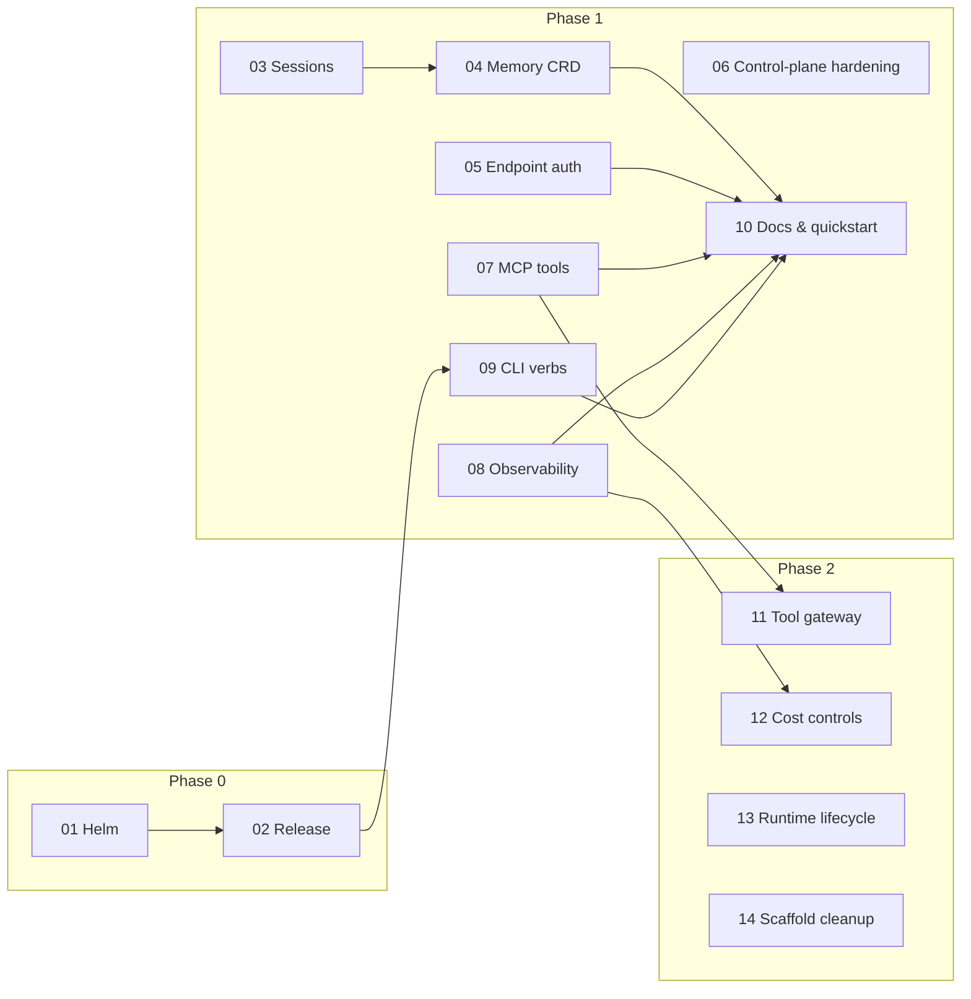

# Flokoa Agent Harness Roadmap

This directory contains the implementation roadmap for evolving Flokoa from an agent deployment platform into a credible **agent harness** (see `AGENT_HARNESS_REVIEW.md` at the repo root for the gap analysis against AWS Bedrock AgentCore).

Each numbered document is a **self-contained implementation unit** sized to be handed to Claude Code (or any engineer) as a single task. Every spec is grounded in the current code: it names the real types, files, and patterns to extend, states the target design, and defines acceptance criteria.

## How to use these specs with Claude Code

Hand over one spec at a time, e.g.:

> Implement `docs/roadmap/03-agent-sessions.md`. Read the spec fully, then read the module CLAUDE.md files it references before writing code. Follow the existing architectural patterns named in the spec. Run the verification steps in the Testing section before finishing.

Conventions that apply to **every** unit:

- **Operator changes** follow the existing layering: `internal/controller` (thin orchestration) → `internal/app/agent` (domain services on `repo` interfaces) → `internal/infra/{repo,builder}` (I/O adapters and pure builders). Tests use the fakes in `internal/infra/repo/fakes/`.
- **CRD changes** are additive and optional (`+optional`, pointer fields), follow the discriminated-union style already used by `RuntimeSpec` / `AgentToolSpec` / `ModelProviderSpec`, and always run the full pipeline: `make manifests generate` then `make generate-python-models` (in `operator/`).
- **Python changes** follow the ports-and-adapters style of `flokoa/integrations` (`_try_load` optional imports, protocol-typed dependencies, optional extras in `pyproject.toml`).
- **Operator → runtime contract** changes (mounted files under `/etc/flokoa/`, `FLOKOA_*` env vars) must stay backward compatible: the runtime falls back gracefully when new config is absent (the existing unified-vs-legacy config loading in `flokoa_managed_agent/config.py` is the precedent).

## Units

### Phase 0 — Table stakes (release engineering)

| # | Spec | Size | Depends on |
|---|------|------|-----------|
| 01 | [Helm chart: webhooks, network policies, completeness](01-helm-chart-webhooks.md) | M | — |
| 02 | [Release pipeline, version alignment, public READMEs](02-release-pipeline.md) | M | 01 (chart publish) |

### Phase 1 — Minimum credible harness

| # | Spec | Size | Depends on |
|---|------|------|-----------|
| 03 | [Conversation sessions in the agent runtime](03-agent-sessions.md) | L | — |
| 04 | [Memory backends + `Agent.spec.memory` CRD field](04-memory-backends.md) | M | 03 |
| 05 | [Inbound auth on agent A2A endpoints](05-agent-endpoint-auth.md) | L | — |
| 06 | [Control-plane hardening: TLS + authorization](06-control-plane-hardening.md) | M | — |
| 07 | [MCP tool support](07-mcp-tools.md) | L | — |
| 08 | [GenAI observability by default](08-genai-observability.md) | M | — |
| 09 | [CLI harness verbs: init / deploy / invoke / logs](09-cli-harness-verbs.md) | M | 02 |
| 10 | [Quickstart, docs IA, Grafana dashboard](10-quickstart-and-docs.md) | M | 03–09 |

### Phase 2 — Differentiation (design sketches, decide before building)

| # | Spec | Size | Depends on |
|---|------|------|-----------|
| 11 | [Tool gateway and policy](11-tool-gateway.md) | XL | 07 |
| 12 | [Cost controls and usage limits](12-cost-controls.md) | M | 08 |
| 13 | [Runtime lifecycle: probes, HPA, hot reload, isolation](13-runtime-lifecycle.md) | L | — |
| 14 | [Scaffold package cleanup](14-scaffold-cleanup.md) | S | — |

## Dependency graph

Units 03/05/06/07/08 are mutually independent and can be worked in parallel branches. Unit 14 can run any time.

## Target architecture

See [00-target-architecture.md](00-target-architecture.md) for the high-level design all units build toward, including the component diagram, the operator↔runtime config contract, and the architectural tenets each spec applies.
