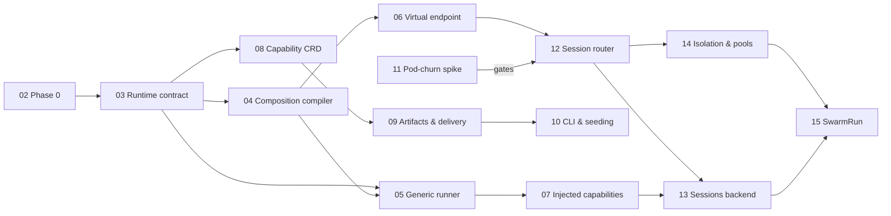

# Flokoa Roadmap — Pivot v2.1 ("Agent Harness for Kubernetes")

This roadmap implements the approved [Product Brief v2.1](00-product-brief.md): **flokoa is the open-source agent harness for Kubernetes — what AgentCore is for AWS** — a Kubernetes-native runtime for single agents and swarms of **pydantic-ai** agents: declarative definitions, packaged capabilities, isolated sessions, event triggers, and an A2A gateway, on your own cluster.

**This supersedes the previous roadmap set** (the AgentCore gap-analysis-driven specs, removed in this commit; see git history and `AGENT_HARNESS_REVIEW.md` for the analysis that led here). Old specs 05 (endpoint auth) and 11 (gateway) thread into the session router; 06 (control-plane hardening) and 08 (observability) thread through all pillars (see [16-cross-cutting.md](16-cross-cutting.md)).

Each numbered document is a self-contained implementation unit sized to hand to Claude Code as a single task, grounded in the codebase as of `main@ac123b5`.

## Ground truth this roadmap is planned against (verified 2026-06-10)

- **No flokoa-owned data path exists.** A2A traffic goes client → agent Service → pods. The session router is a new build.
- **AgentWorkflow is template-only**: the controller still compiles to Argo `WorkflowTemplate`s (`compileAndApply`), but `SubmitRun`/run-tracking is gone from the codebase. Frozen per brief §7.
- **AgentTrigger runs on Argo Events**: `AgentTriggerSpec` references EventSource/EventBus with Sensor data-filter semantics; Sensors POST to `flokoa-server`'s invoke endpoint (`internal/server/trigger_handler.go`), with rate limiting (`trigger_limiter.go`), session-key extraction (`trigger_session.go`), and A2A push-notification delivery (`push_gateway.go`). `docs/agenttrigger-rfc.md` describes the stale Knative design — reconciled in Phase 0.
- **Release machinery exists**: `release.yml` (tag-triggered, 5-image matrix incl. managed-task), `CHANGELOG.md`, versions aligned at 0.1.0. Phase 0 is deletions + residual gaps, not a build-out.
- **Deletions to perform** (still present): google-adk integration, the integrations registry, `flokoa-managed-task` (+ its release-matrix entry), Argo Workflows *run* docs/samples.

## Units by phase

| Phase | # | Spec | Size |
|---|---|------|------|
| — | 00 | [Product Brief v2.1](00-product-brief.md) (canonical strategy) | — |
| — | 01 | [Target architecture](01-target-architecture.md) | — |
| **Phase 0** | 02 | [Cleanup & release baseline](02-phase0-cleanup-and-release.md) | M |
| **P0a** | 03 | [Runtime contract (keystone)](03-runtime-contract.md) | M |
| **P0a** | 04 | [Agent CRD as composition root + spec compiler](04-agent-crd-composition.md) | XL |
| **P0a** | 05 | [Generic runner](05-generic-runner.md) | L |
| **P0a** | 06 | [Virtual endpoint identity](06-virtual-endpoint-identity.md) | S |
| **P0a** | 07 | [Platform-injected capabilities](07-platform-injected-capabilities.md) | M |
| **P0b** | 08 | [Capability CRD + admission](08-capability-crd.md) | L |
| **P0b** | 09 | [Capability artifacts & delivery](09-capability-artifacts-delivery.md) | L |
| **P0b** | 10 | [Capability CLI & registry seeding](10-capability-cli-and-registry.md) | L |
| **P1** | 11 | [Pod-churn spike (gate)](11-pod-churn-spike.md) | M |
| **P1** | 12 | [Session router](12-session-router.md) | XL |
| **P1** | 13 | [Sessions state backend (Postgres)](13-sessions-state-backend.md) | L |
| **P1** | 14 | [Isolation tiers & warm pools](14-isolation-tiers-and-pools.md) | L |
| **P2** | 15 | [SwarmRun (design sketch)](15-swarmrun.md) | XL |
| — | 16 | [Cross-cutting threads: observability & hardening](16-cross-cutting.md) | ongoing |

## Dependency graph

04+05 are co-designed against 03 (the contract) and must merge together with a working end-to-end path. 08–10 can proceed in parallel with 05–07 once 03 lands. 11 runs any time before 12 commits publicly.

## How to hand a unit to Claude Code

> Implement `docs/roadmap/NN-….md`. Read the spec fully, then `docs/roadmap/00-product-brief.md` §(referenced sections) and the module CLAUDE.md files it names. Follow the existing layering (controller → app → infra; ports-and-adapters in Python). Run the verification steps before finishing.

Conventions: CRD changes are additive where possible and always run `make manifests generate` + `make generate-python-models`; secrets only via `SecretKeySelector` projection; new behavior behind Helm values/flags; the operator↔runner contract (03) is versioned and changes to it are PR-blocking review items.
